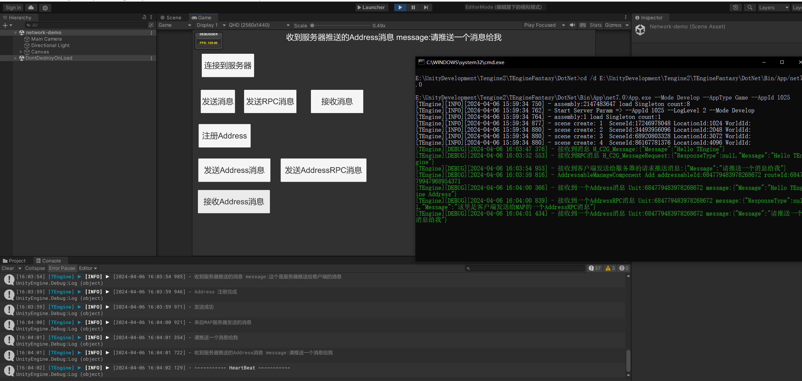
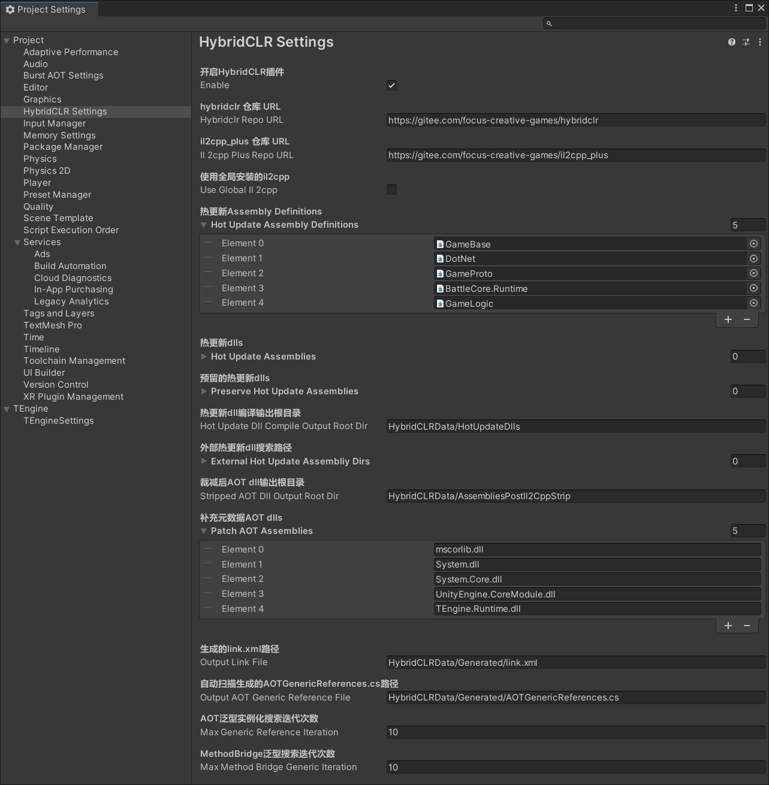
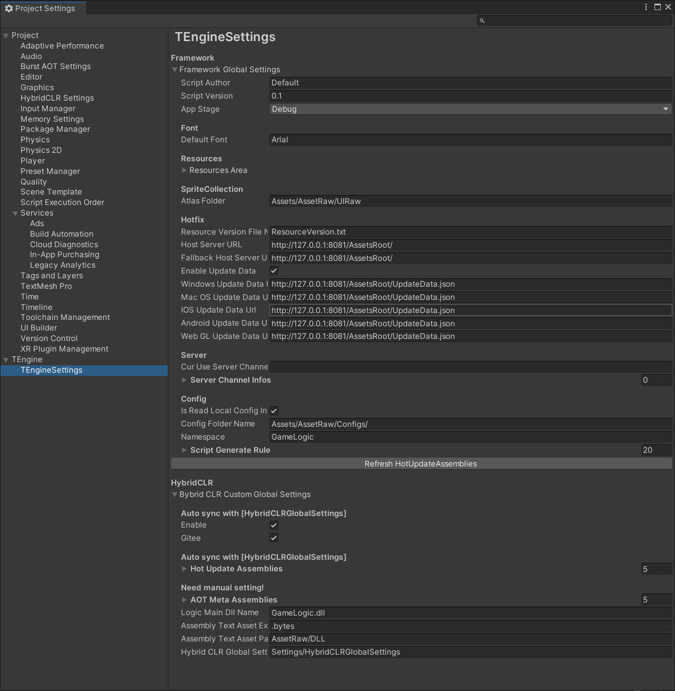
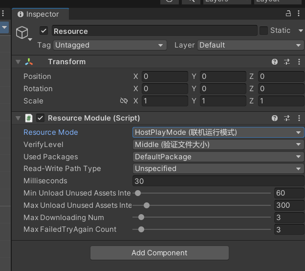

# 为什么使用Tengine？
### 优点
1.Tengine是一款优秀的unity框架解决方案，该框架整合了GameFramework、fantasy、HybridCLR等优秀框架或解决方案为一体，使双端开发都变得简单友好。
2.框架也有商业项目正在使用，是经过验证的可靠方案，足以满足基本的商业需求。
3.社群活跃，一个长期使用的项目来说，活跃的社群或社区是很重要的。
### 缺点
由于整合了很多其他的框架或解决方案，所有在面对特殊需求时（如改变游戏框架底层逻辑、需要更可靠且高性能的网络等），就要更多的了解其中的部分源码来解决问题。本文章也由此应运而生。



[Tengine--gitee](https://gitee.com/game-for-all_0/TEngine)
[Tengine--github](https://github.com/ALEXTANGXIAO/TEngine)
[Luban游戏配置解决方案](https://luban.doc.code-philosophy.com/)
[Hybridclrc#热更方案](https://hybridclr.doc.code-philosophy.com/)
[YooAsset资源管理系统](https://www.yooasset.com/)
[UniTask异步方案](https://github.com/Cysharp/UniTask)
[fantasy服务器框架](https://github.com/qq362946/Fantasy)



# Tengine目录结构

### TEngineFantasy目录结构
```TEngineFantasy
├─ Assets           资产目录
├─ Books            手册
├─ DotNet           后端服务器     
├─ Luban            luban目录（文件服务器目录）
```

### Asset目录结构
```目录
Assets
├── AssetRaw        资源目录
├── Atlas           图集目录
├── GameScripts     热更程序集目录
├── Scenes          主场景目录
└── TEngine              
    ├── AssetSetting        YooAsset资源设置  
    ├── Editor              TEngine-Editor程序集
    └── Runtime             TEngine-Runtime程序集
```
# Tengine双端测试[^1]

1.在[Tengine--gitee](https://gitee.com/game-for-all_0/TEngine)官网clone一份项目库，切换到fantasy分支，然后在Unity2021.3以上的版本中，打开UnityProject文件夹。

需要注意的是，unity需要提前安装IL2cpp模块才能使用YooAsset、Hybridclr等功能

2.在EditorMode下运行network-demo场景
3.在luban文件夹里，运行gen_code_bin_to_server，生成一下服务端代码
4.在Donet文件夹里开启server解决方案，运行启动项目

（1）vs可能会生成解决方案失败，一般原因是由于ThirdParty的MongoDb.Driver包版本落后导致，将其更新为一致的版本。
（2）生成解决方案之后，也可以运行start_develop来更方便的开启服务端，这个bat文件已经填好了运行需要的参数，可以自行更改。

5.进行双端的消息传输测试


# Tengine热更测试
## 准备工作
在热更之前，需求做一些准备工作来确保环境正常
1.确保安装了Hybridclr，且环境配置正确




如果Hybridclr Enable未开启，需要开启Hybridclr/Define Symbols/Enable Hybridclr，来在Tengine逻辑里打开预编译常量

2.确认Tengine的设置是你想要的



3.打开main场景，确保其中的ResourceModule模块中，ResourceMode设置为联机运行模式（最好将运行模式也改为联机运行模式）




4.运行菜单 HybridCLR/Generate/All 进行必要的生成操作。这一步不可遗漏!!!
5.运行菜单 HybridCLR/Build/BuildAssets And CopyTo AssemblyPath，生成热更新dll并copy到热更程序集中。
6.运行菜单 YooAsset/AssetBundle Builder 构建AB
7.打开Build Settings对话框，点击Build，打包热更新示例工程。

## 文件服务器开启
1.安装node.js,配置好npm环境变量（网上自己查）
2.打开文件服务器目录，运行install.bat进行npm安装
3.新建AssetsRoot文件夹，在里面放入AB包生成的文件和GameScripts\Main\Launcher\Resources\AssetLoad\UpdataData.json文件

UpdataData.json文件可以改变热更新的服务器地址和热更新显示方式，这样可以通过配置这个文件来实时更新配置

4.运行start.bat开启文件服务器


[^1]: [Tengine快速入门](https://gitee.com/game-for-all_0/TEngine/blob/main/Books/1-%E5%BF%AB%E9%80%9F%E5%BC%80%E5%A7%8B.md)
